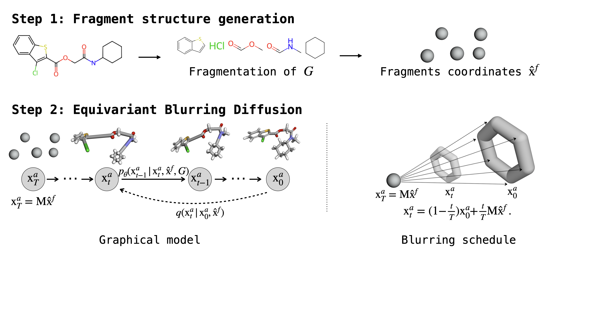

# Equivariant Blurring Diffusion
Pytorch implementation of [Equivariant Blurring Diffusion for Hierarchical Molecular Conformer Generation](https://arxiv.org/pdf/2410.20255v1) (NeurIPS 2024)

Jiwoong Park, Yang Shen 

License: GPL-3.0 (If you are interested in a different license, for example, for commercial use, please contact us.)



## Environments
```bash
conda env create -f environment.yml
# Activate the environment
conda activate ebd
pip install torch==1.8.1+cu111 torchvision==0.9.1+cu111 torchaudio==0.8.1 -f https://download.pytorch.org/whl/torch_stable.html
pip install torch-scatter==2.0.6 -f https://pytorch-geometric.com/whl/torch-1.8.1+cu111.html
pip install torch-sparse==0.6.11 -f https://pytorch-geometric.com/whl/torch-1.8.1+cu111.html
pip install torch-cluster==1.5.9 -f https://pytorch-geometric.com/whl/torch-1.8.1+cu111.html
pip install torch-spline-conv==1.2.1 -f https://pytorch-geometric.com/whl/torch-1.8.1+cu111.html
pip install torch-geometric==1.7.2
pip install easydict==1.11
pip install tensorboard==2.11.2
pip install rdkit==2023.3.2
pip install rmsd==1.5.0
```

## Preprocessing
1. Make folder `logs/`.
2. Download `Drugs.zip` from [[here]](https://zenodo.org/records/13882973) and unzip in `data/GEOM/`.
3. Download `samples.zip` from [[here]](https://zenodo.org/records/13882973) and unzip in `trained_model/`.


## Train
```bash
python train_atom.py ./config/drugs_default.yml
```


## Generation
Use the provided checkpoint or the checkpoint from your own trained model to generate conformers.
Example when using the provided checkpoint:
```bash
python test.py ./trained_model/checkpoints/drugs_ckpt.pt
```


## Evaluation
Use the provided conformers from the provided checkpoint or from your own trained model to evaluate conformers.


```bash
python eval_covmat.py ./trained_model/samples/samples_all.pkl
```

## Acknowledgements
The implementation cannot proceed without referencing https://github.com/ehoogeboom/e3_diffusion_for_molecules, https://github.com/MinkaiXu/GeoDiff, https://github.com/PattanaikL/GeoMol, https://github.com/gcorso/torsional-diffusion, https://github.com/AaltoML/generative-inverse-heat-dissipation, https://github.com/THUNLP-MT/PS-VAE, https://github.com/wengong-jin/icml18-jtnn, https://github.com/zaixizhang/FLAG, https://github.com/gcorso/DiffDock, https://github.com/octavian-ganea/equidock_public, http://www.rdkit.org/docs/index.html, https://hunterheidenreich.com/posts/kabsch_algorithm/.


## Citation

```
@inproceedings{
  park2024equivariant,
  title={Equivariant Blurring Diffusion for Hierarchical Molecular Conformer Generation},
  author={Jiwoong Park and Yang Shen},
  booktitle={The Thirty-eighth Annual Conference on Neural Information Processing Systems},
  year={2024},
  url={https://openreview.net/forum?id=Aj0Zf28l6o}
}
```
