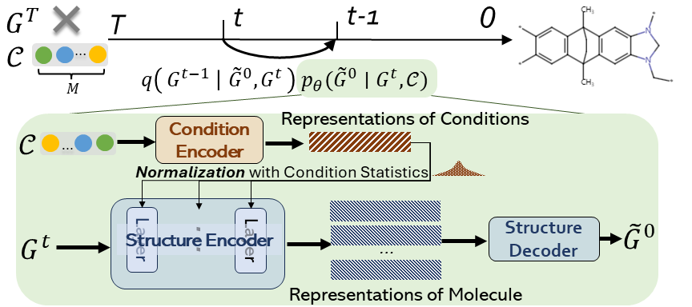
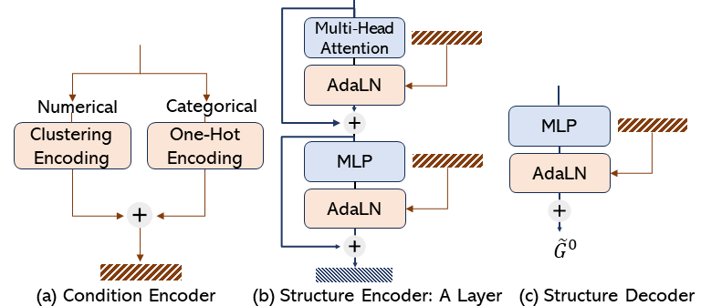

Graph Diffusion Transformer for Multi-Conditional Molecular Generation
================================================================

Paper: https://arxiv.org/abs/2401.13858 (NeurIPS 2024 Oral)

This is the code for Graph DiT. The denoising model architecture in `graph_dit/models` looks like:

<div style="display: flex;" markdown="1">
      
      
</div>

## 1, 2. Requirements and Data Download

All dependencies are specified in the `requirements.txt` file.

This code was developed and tested with Python 3.9.16, PyTorch 2.0.0, and PyG 2.3.0, Pytorch-lightning 2.0.1.

For molecular generation evaluation, we should first install rdkit.

Then `fcd_torch`: `pip install fcd_torch` (https://github.com/insilicomedicine/fcd_torch).

And `mini_moses` package: `pip install git+https://github.com/igor-krawczuk/mini-moses` (https://github.com/igor-krawczuk/mini-moses),


## 3. Explanation of Code
This fork is based on **Graph-DiT**  
<https://github.com/liugangcode/Graph-DiT>
```
graph-dit/
├── diffusion_model.py
├── diffusion_utils.py
├── noise_schedule.py
├── molecular_metrics_sampling.py
├── rdkit_functions.py
└── … (unchanged upstream files)
```
All custom changes are marked with # @@ comments.
# 3.1. What I changed
| File                                | Patch summary                                                                                                                                                                                                                  |
| ----------------------------------- | ------------------------------------------------------------------------------------------------------------------------------------------------------------------------------------------------------------------------------ |
| **`diffusion_model.py`**            | • added **`compute_laplacian_eigenvalues()`** (private util) and now pass its output into **`apply_noise()`** • inside `training_step()` we call `apply_noise(..., eigenvalues=...)` so each graph’s spectrum guides noise     |
|                                     | • `apply_noise()` unchanged interface externally—extra keyword is optional, keeping backwards-compat                                                                                                                           |
| **`diffusion_utils.py`**            | • added five *discrete* β-schedulers: `exponential_-`, `sigmoid_-`, `linear_-`, `ddim_-`, **`polynomial_beta_schedule_discrete()`** • plus two scaled variants (`scaled_cosine`, `scaled_poly`) for global scaling experiments |
| **`noise_schedule.py`**             | • accepts new names (`poly`, `sigmoid`, …). Selecting `"poly"` automatically multiplies the β-curve by `0.05` (our best global noise) • same for `"clipcosine"`                                                                |
| **`molecular_metrics_sampling.py`** | • pipeline now logs **uniqueness** and **novelty**; returns them so CSV & tensorboard capture diversity signals                                                                                                                |
| **`rdkit_functions.py`**            | • added helpers `compute_uniqueness()` and `compute_novelty()` • relaxed-validity path now skips force-correction for speed (commented old block)                                                                              |

**Per-graph Laplacian → adaptive noise**
training_step() → compute_laplacian_eigenvalues() (Torch torch.linalg.eigh) → pass tensor to apply_noise().
Inside apply_noise() each β<sub>t</sub> is scaled by the chosen heuristic s₁…s₅, e.g.
β̃ = β × (e – e_min + 1) (our default s₄).

**Scheduler plug-in**
Select in cfg.model.diffusion_noise_schedule.
Example:
```
diffusion_noise_schedule: 'poly' 
diffusion_steps: 500
```
**Debugging hooks**
Uncomment the print lines inside
- laplacian_compute() – dumps full eigen-tensor per batch.
- apply_noise() – prints the final scaled β values to verify heuristic behaviour.

## 4. Usage
Environments Setting
You shold make a new conda envs
```
conda create -n graph-dit python==3.9.16
conda activate graph-dit
pip install git+https://github.com/igor-krawczuk/mini-moses
pip install -r requirements.txt
```
We could train the model on an A6000 GPU card. Here is an example to running the code for polymer graphs:
```
python main.py --config-name=config.yaml \
                model.ensure_connected=True \
                dataset.task_name='O2-N2-CO2' \
                dataset.guidance_target='O2-N2-CO2'
```
All default configurations can be found in `configs/config.yaml`. In this example, we set `model.ensure_connected=True` to ensure that all generated components are retained during graph-to-molecule conversion (see paper Section 3.2).

Feel free to test the code on your own dataset!


## Citation

[1]Liu, G., Xu, J., Luo, T., and Jiang, M., “Graph Diffusion Transformers for Multi-Conditional Molecular Generation”, <i>arXiv e-prints</i>, Art. no. arXiv:2401.13858, 2024. doi:10.48550/arXiv.2401.13858.
[2]Vignac, C., Krawczuk, I., Siraudin, A., Wang, B., Cevher, V., and Frossard, P., “DiGress: Discrete Denoising diffusion for graph generation”, <i>arXiv e-prints</i>, Art. no. arXiv:2209.14734, 2022. doi:10.48550/arXiv.2209.14734.


